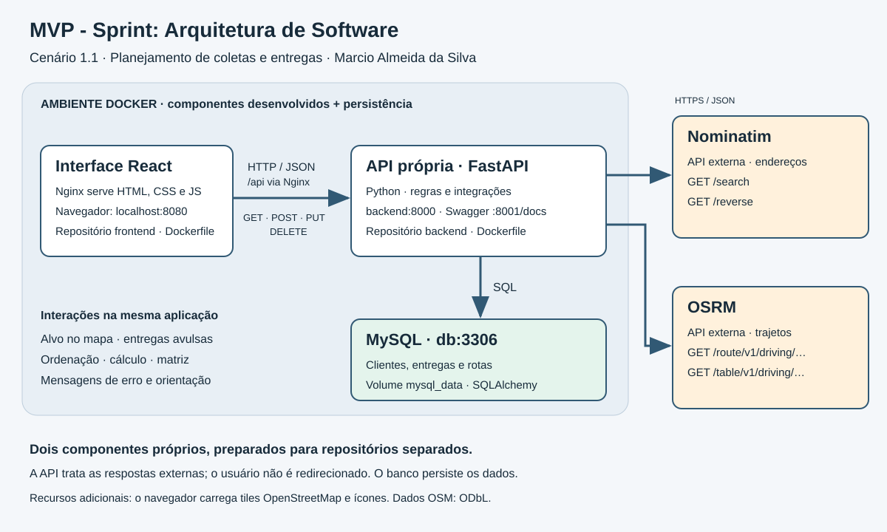

# MVP - Sprint: Arquitetura de Software | Backend

API REST Python/FastAPI para planejamento de coletas e entregas.
Autor: **Marcio Almeida da Silva**, Pós-Graduação em Engenharia de Software,
PUC-Rio. Persiste dados com SQLAlchemy/MySQL, consulta Nominatim para endereços
e OSRM para trajetos e matrizes. Cenário 1.1 do enunciado.



## Executar com Docker

Pré-requisitos: Docker Desktop/Engine com Compose 2.24.4+ e internet.
Clone este repositório como backend, ao lado do repositório da interface:

```text
mvp/
  frontend/compose.yaml
  backend/Dockerfile
```

Na pasta frontend, copie .env.example para .env, defina as senhas e o contato,
e execute:

```powershell
docker compose up -d --build --wait
```

O Compose está na raiz do repositório da interface, conforme o enunciado.
Ele constrói esta API usando seu Dockerfile próprio, inicia o MySQL e o frontend.
Não é necessário instalar Python ou MySQL na máquina.
Swagger: http://localhost:8001/docs. Saúde: http://localhost:8001/api/health.
O schema e as migrações são aplicados automaticamente; não importe schema.sql.

Para construir somente a imagem, nesta pasta:

```powershell
docker build --target production -t mvp-backend .
```

A imagem precisa das variáveis DATABASE_HOST, DATABASE_USER, DATABASE_PASSWORD
e DATABASE_NAME para acessar um MySQL na mesma rede; o Compose já as configura.

## Desenvolvimento local opcional

Requer Python 3.11+ e um MySQL existente com banco e usuário autorizados.

```powershell
python -m venv .venv
.venv\Scripts\Activate.ps1
pip install -r requirements.txt
Copy-Item .env.example .env
# Ajuste DATABASE_URL e FRONTEND_ORIGIN no .env.
uvicorn app.main:app --reload
```

No Linux/macOS: `source .venv/bin/activate` e `cp .env.example .env`.
Swagger local: http://localhost:8000/docs. Use uma conta de banco própria,
não a configuração ilustrativa de root do arquivo de exemplo.

## Rotas e contratos

O Swagger e /openapi.json são a referência completa de campos e respostas.
Existem 17 operações HTTP, incluindo GET, POST, PUT e DELETE.

| Método | Rota | Finalidade |
| --- | --- | --- |
| GET | /api/health | Saúde da API |
| GET, POST | /api/clientes | Listar e criar clientes |
| PUT, DELETE | /api/clientes/{cliente_id} | Editar e excluir clientes |
| POST | /api/clientes/geocodificar | Endereço para coordenadas |
| POST | /api/clientes/geocodificar-reverso | Coordenadas para endereço |
| GET, POST | /api/empresa/endereco | Consultar e salvar a empresa |
| GET, POST | /api/entregas | Listar e criar entregas |
| PUT, DELETE | /api/entregas/{entrega_id} | Editar ou excluir entrega |
| POST | /api/entregas/avulsas | Criar sem cliente, com ponto no mapa |
| PUT | /api/entregas/avulsas/{entrega_id} | Editar entrega avulsa |
| POST | /api/rotas/calcular | Calcular e salvar a rota |
| POST | /api/rotas/matriz | Comparar distâncias e tempos |

O cálculo recebe `{"entrega_ids":[3,1,2]}`, preserva a sequência e parte da
empresa. Substitua os IDs por entregas existentes. A matriz aceita 1 a 24 entregas.
Excluir uma entrega remove rotas vinculadas, sem excluir cliente/endereço.

## Organização e persistência

- app/routers: endpoints por domínio.
- app/services/external_maps.py: integrações, cache, limites e erros externos.
- app/models.py e app/schemas.py: persistência e contratos.
- app/migrations.py: adequação idempotente de tabelas existentes.
- tests/: verificações de integração e falhas com respostas externas simuladas.

O MySQL persiste empresa, clientes, endereços, entregas, dados avulsos,
rotas e sua sequência de paradas. O volume Docker é independente dos containers.
A geometria usa LONGTEXT no MySQL para suportar trajetos extensos.

## Testes

Na pasta backend, com as dependências instaladas:

```powershell
python -m unittest discover -s tests -v
```

Os testes usam SQLite temporário e provedores simulados; não alteram o MySQL real.
Erros externos são tratados, e falhas de gravação executam rollback.

## Integrações e documentação

[APIs externas: rotas, condições e licenças](docs/APIS_EXTERNAS.md).
As respostas externas são tratadas e devolvidas em JSON, sem redirecionar o usuário.
Não publique .env, dumps do banco, dados de clientes ou diretórios .venv.
